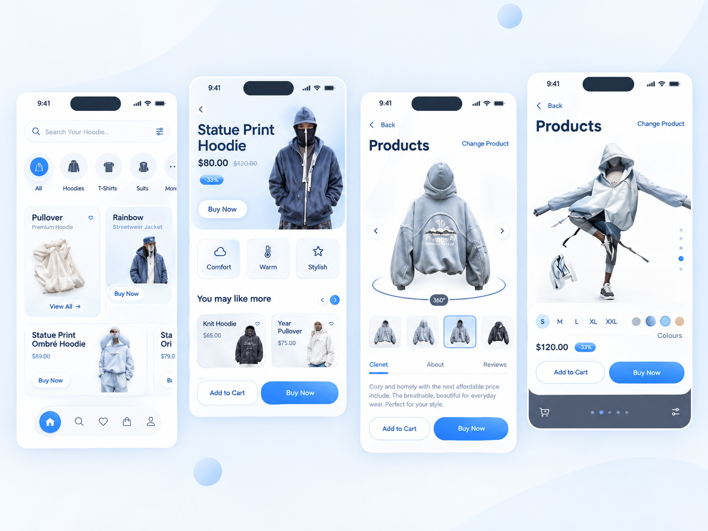

# FrostWear — White Label Fashion Shopping App

A polished, responsive fashion-shopping app recreated from the provided mobile UI reference and redesigned into a clean **white-label / light blue theme**.

The project is built with **pure HTML, CSS and JavaScript** and is structured like a real mobile shopping experience instead of a single static screen.

## ✨ Demo Preview

The image below shows a demo preview of the FrostWear app UI:



> **Demo image:** `demo.png`

## 🎯 Design Goals

- Keep the original screen composition and visual hierarchy recognizable.
- Convert the dark visual language into a clean light / white-label interface.
- Use a soft blue + cyan accent palette.
- Keep cards, controls, spacing, buttons and navigation consistently arranged.
- Make product visuals remain sharp with responsive image containers.
- Make the app feel like a connected shopping product rather than separate mockups.

## 📱 Included App Screens

### 1. Home
- Search bar
- Product categories
- Featured products
- Popular products
- Product cards
- Wishlist buttons
- Quick Buy buttons

### 2. Search
- Product search input
- Live filtering
- Empty-state message
- Matching product cards

### 3. Product Details
- Product image / viewer
- 360° style badge
- Product thumbnails
- Product navigation
- Product tabs
- Description
- Size selector
- Color selector
- Add to Cart
- Buy Now

### 4. Saved / Wishlist
- Saved product grid
- Heart toggle interaction
- Empty wishlist state

### 5. Shopping Bag
- Added products
- Item count
- Subtotal calculation
- Checkout action
- Empty bag state

### 6. Profile
- User profile card
- Orders
- Addresses
- Notifications
- Appearance settings

## 🛠️ Tech Stack

- **HTML5** — semantic app structure
- **CSS3** — responsive layout, cards, gradients, shadows, navigation and UI states
- **Vanilla JavaScript** — navigation, search, wishlist, cart, product selection and toast feedback
- **SVG / CSS UI elements** — lightweight interface graphics without an icon-font dependency

## 📂 Project Structure

```text
frostwear-fashion-app/
├── index.html
├── style.css
├── script.js
├── demo.png
├── README.md
└── assets/
    ├── reference.png
    ├── hoodie-main.jpg
    ├── hoodie-light.jpg
    ├── jacket.jpg
    ├── home-product.jpg
    └── model.jpg
```

## ⚡ Main Features

- Responsive mobile-first app shell
- iPhone-style status bar and bottom navigation
- Active navigation states
- Smooth screen switching
- Live product search
- Product detail interactions
- Size selection
- Color selection
- Wishlist toggle
- Cart / bag state
- Dynamic cart counter
- Subtotal calculation
- Toast notifications
- Empty states
- Responsive layout for smaller screens
- No external UI framework required
- No external icon-font dependency

## 🎨 Color System

The white-label theme is based around:

- **Background:** soft ice blue / white
- **Surface:** pure white
- **Primary:** vibrant blue
- **Accent:** cyan
- **Text:** deep navy
- **Secondary text:** muted blue-gray
- **Borders:** very light blue-gray

This palette keeps the interface clean, premium and suitable for a modern fashion / e-commerce product.

## 🚀 How to Run

### Option 1 — Directly in Browser

1. Download or extract the project.
2. Open `index.html` in a modern browser.
3. Start interacting with the app.

### Option 2 — VS Code Live Server

1. Open the project folder in VS Code.
2. Install **Live Server**.
3. Right-click `index.html`.
4. Select **Open with Live Server**.

## 🌐 GitHub Deployment

This project is static and can be deployed directly with **GitHub Pages**.

1. Create a new GitHub repository.
2. Upload all project files.
3. Go to **Settings → Pages**.
4. Select the main branch and root folder.
5. Save and open the generated GitHub Pages URL.

## 🖼️ Demo Image Usage

The demo preview image is included in the project root:

```text
demo.png
```

That makes the README preview work correctly on GitHub without requiring an external image host.

## 🔧 Customization

You can easily customize:

- Brand name
- Product names
- Prices
- Product images
- Category names
- Theme colors
- Buttons
- User profile content
- Navigation labels
- Product descriptions

Most visual colors are defined as CSS variables at the top of `style.css`.

## 📌 Important Files

### `index.html`
Contains the application shell, status bar, main screen container and bottom navigation.

### `style.css`
Contains the complete visual system including responsive behavior, product cards, buttons, detail views, states and mobile layout.

### `script.js`
Controls app navigation, search, wishlist, bag/cart state, product details and user feedback messages.

### `assets/reference.png`
The white-label visual reference used for the overall design direction.

## ✅ Project Status

**Complete frontend prototype / static app UI**

The project is ready for:

- GitHub upload
- GitHub Pages
- Portfolio showcase
- Frontend UI demonstrations
- Further backend/API integration

## 👨‍💻 Author

**Muzammil Hussain**  
Frontend Developer

### Built With

`HTML5` · `CSS3` · `JavaScript` · `Responsive UI` · `SVG`

---

### License

This project is intended for learning, portfolio and frontend demonstration purposes. Replace product imagery and branding as needed for production/commercial use.
